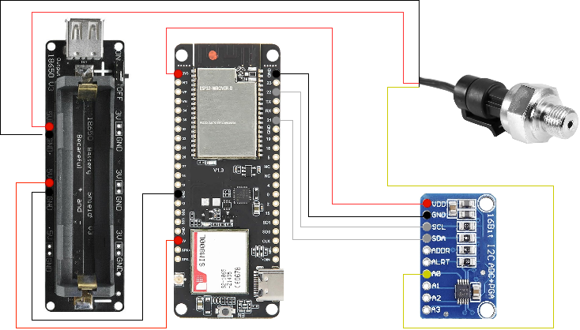

# Pressure-sensor-IoT
Check pressure of a gas tank with dev board TTGO T-Call V1.3 ESP32. Project developed with PlatformIO for Visual Studio Code.

Components:

- TTGO T-Call V1.3 ESP32. It is a dev board with the ESP32 microcontroller and a SIM800L GSM module.
- 18650 battery shield for power. It has voltage retgulator to give 5 and 3 V. It is also already prepared to charge the battery via micro-USB.
- ADC ADS1115 powered with the 3.3V output of the ESP32, since the GPIO pins of the ESP32 do not support voltages above that value.
- To measure the pressure I used a sensor which is power with 5V and gives a signal between 0 and 4.5V, which corresponds from 0 to 12 bar (pressure over 6 bar is not expected, so the signal voltage should be kept below 3.3V).

Diagram:

You will see your data in Thingspeak:

